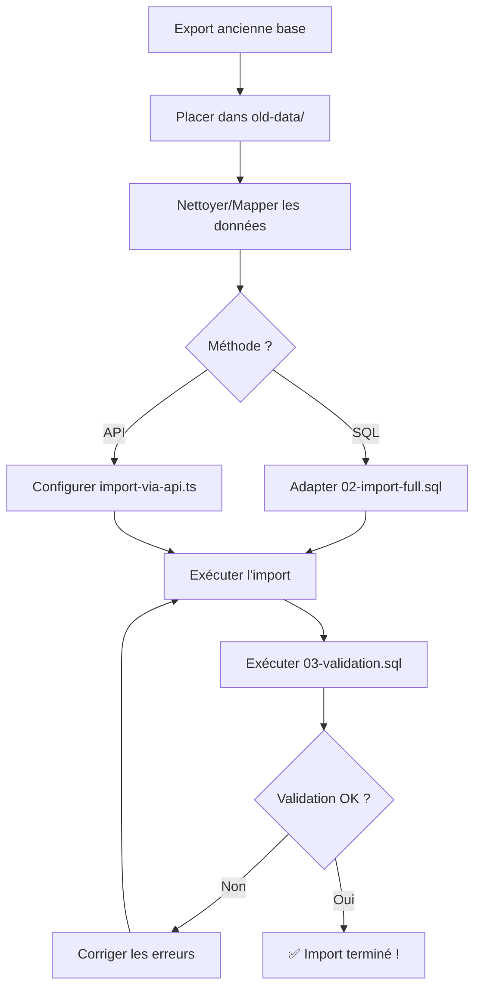

# 📦 Kit d'Import de Données - Go-Prod-AURA

## 🎯 Vue d'ensemble

Ce kit complet vous permet d'importer les données de votre ancienne base Supabase vers la nouvelle base **Go-Prod-AURA** en toute sécurité.

---

## 📂 Structure du dossier

```
database/
├── INDEX.md                           # ← Vous êtes ici
├── README-IMPORT.md                   # Documentation complète
├── MAPPING-GUIDE.md                   # Guide de mapping des colonnes
├── IMPORT-CHECKLIST.md                # Checklist étape par étape
│
├── 01-schema-current.sql              # Schéma actuel de Go-Prod-AURA (référence)
├── 02-import-full.sql                 # Script SQL d'import complet
├── 03-validation.sql                  # Vérifications post-import
├── import-via-api.ts                  # Script TypeScript pour import via API
│
└── old-data/                          # Placer vos exports ici
    ├── README.md                      # Instructions d'export
    ├── template_artists.csv           # Template de données
    ├── template_spotify_data.csv
    ├── template_social_media_data.csv
    ├── template_events.csv
    └── template_event_artists.csv
```

---

## 🚀 Démarrage rapide

### 1️⃣ Choisir votre méthode

| Méthode | Avantages | Inconvénients | Recommandé pour |
|---------|-----------|---------------|-----------------|
| **SQL direct** (`02-import-full.sql`) | ✅ Très rapide<br>✅ Gros volumes<br>✅ Transactions atomiques | ❌ Nécessite accès SQL Editor<br>❌ Moins de feedback | Production, gros volumes (>10k lignes) |
| **API TypeScript** (`import-via-api.ts`) | ✅ Import progressif<br>✅ Feedback en temps réel<br>✅ Gestion d'erreurs par batch | ❌ Plus lent<br>❌ Nécessite Node.js | Dev, volumes moyens (<10k lignes) |

---

### 2️⃣ Workflow recommandé



---

## 📚 Documentation par fichier

### 📖 Guides

| Fichier | Description | Quand l'utiliser |
|---------|-------------|------------------|
| **README-IMPORT.md** | Documentation complète du processus | Première lecture obligatoire |
| **MAPPING-GUIDE.md** | Mapping détaillé des colonnes anciennes → nouvelles | Lors de l'adaptation des données |
| **IMPORT-CHECKLIST.md** | Checklist étape par étape | Pendant tout le processus |

### 🛠️ Scripts SQL

| Fichier | Description | Utilisation |
|---------|-------------|-------------|
| **01-schema-current.sql** | Schéma de référence (ne pas exécuter si déjà créé) | Documentation uniquement |
| **02-import-full.sql** | Script d'import complet avec données de test | À adapter puis exécuter |
| **03-validation.sql** | Vérifications post-import | Exécuter après l'import |

### 💻 Scripts TypeScript

| Fichier | Description | Utilisation |
|---------|-------------|-------------|
| **import-via-api.ts** | Import via API Supabase avec logs en temps réel | Alternative à l'import SQL |

---

## ⚡ Exemples d'utilisation

### Exemple 1 : Import SQL rapide (données de test)

```bash
# 1. Ouvrir Supabase Dashboard > SQL Editor
# 2. Copier-coller le contenu de 02-import-full.sql
# 3. Exécuter (Cmd/Ctrl + Enter)
# 4. Vérifier avec 03-validation.sql
```

**Résultat attendu :**
```
✅ 6 artists importés
✅ 5 spotify_data importés
✅ 5 social_media_data importés
✅ 4 events importés
✅ 6 event-artist relations importées
```

---

### Exemple 2 : Import API avec vos propres données

```bash
# 1. Placer vos CSV dans database/old-data/
cd go-prod-aura

# 2. Installer les dépendances
npm install @supabase/supabase-js papaparse
npm install --save-dev @types/papaparse tsx

# 3. Configurer les variables d'environnement
export VITE_SUPABASE_URL="https://xxxxx.supabase.co"
export SUPABASE_SERVICE_KEY="eyJhbGciOiJIUzI1NiIsInR5cCI6IkpXVCJ9..."

# 4. Exécuter l'import
npx tsx database/import-via-api.ts

# 5. Vérifier dans SQL Editor avec 03-validation.sql
```

**Output attendu :**
```
========================================
IMPORT DE DONNÉES - Go-Prod-AURA
========================================

[INFO] Vérification de la company par défaut...
[SUCCESS] Company par défaut existe déjà

--- IMPORT ARTISTS ---
[INFO] CSV parsé : 128 lignes dans artists.csv
[INFO] ✓ Batch 1 inserted (50/128)
[INFO] ✓ Batch 2 inserted (100/128)
[INFO] ✓ Batch 3 inserted (128/128)
[SUCCESS] Artists importés : 128/128 (échecs : 0)

--- IMPORT SPOTIFY DATA ---
[INFO] CSV parsé : 127 lignes dans spotify_data.csv
...

========================================
RÉSUMÉ DE L'IMPORT
========================================
Total logs: 45
Erreurs: 0
Warnings: 1
========================================

[SUCCESS] Import terminé avec succès !
```

---

## 📊 Données de test incluses

Le script `02-import-full.sql` inclut des données de test prêtes à l'emploi :

### Artists (6)
- DJ Shadow
- Emma Johnson
- The Midnight
- Bonobo
- Amelie Lens
- Vintage Artist (archived)

### Events (4)
- Montreux Jazz Festival 2024
- Paléo Festival 2024
- Geneva Electronic Festival 2025
- Lausanne Lights 2025

**Pour tester rapidement l'application :** exécutez `02-import-full.sql` sans modification.

---

## 🔍 Vérifications automatiques

Le script `03-validation.sql` vérifie automatiquement :

✅ Comptage des enregistrements  
✅ Intégrité des FK (foreign keys)  
✅ Contraintes UNIQUE  
✅ Valeurs obligatoires (NOT NULL)  
✅ Couverture Spotify/Social Media  
✅ Validité des URLs  
✅ Statistiques Spotify (followers, popularity)  
✅ Fonctionnement des RPC functions  

---

## ⚠️ Sécurité

### Pendant l'import (DEV uniquement)

```sql
-- Désactiver RLS temporairement
ALTER TABLE public.artists DISABLE ROW LEVEL SECURITY;
-- ...

-- Désactiver les contraintes FK
SET session_replication_role = 'replica';
```

### Après l'import (PRODUCTION)

```sql
-- Réactiver RLS
ALTER TABLE public.artists ENABLE ROW LEVEL SECURITY;
-- ...

-- Réactiver les contraintes FK
SET session_replication_role = 'origin';
```

**⚠️ IMPORTANT :** Ne jamais laisser RLS désactivé en production !

---

## 🆘 Dépannage

### Erreur : "duplicate key value violates unique constraint"

**Cause :** Un artiste avec le même `id` existe déjà.

**Solution :**
```sql
-- Supprimer les doublons avant import
DELETE FROM public.artists
WHERE id IN (SELECT id FROM old_data_artists);

-- Ou utiliser ON CONFLICT
INSERT INTO public.artists (...)
VALUES (...)
ON CONFLICT (id) DO NOTHING;
```

---

### Erreur : "violates foreign key constraint"

**Cause :** Un `artist_id` référencé n'existe pas dans `artists`.

**Solution :**
```sql
-- Vérifier les orphelins
SELECT * FROM old_spotify_data s
LEFT JOIN old_artists a ON a.id = s.artist_id
WHERE a.id IS NULL;

-- Supprimer les orphelins
DELETE FROM old_spotify_data
WHERE artist_id NOT IN (SELECT id FROM old_artists);
```

---

### Erreur : "invalid input syntax for type uuid"

**Cause :** Un ID n'est pas au format UUID valide.

**Solution :**
```sql
-- Vérifier les UUID invalides
SELECT id FROM old_artists
WHERE id !~ '^[0-9a-f]{8}-[0-9a-f]{4}-[0-9a-f]{4}-[0-9a-f]{4}-[0-9a-f]{12}$';

-- Générer de nouveaux UUID
UPDATE old_artists
SET id = gen_random_uuid()
WHERE id IS NULL OR id = '';
```

---

## 📞 Support

### Documentation
- **Supabase Docs** : https://supabase.com/docs
- **PostgreSQL Docs** : https://www.postgresql.org/docs/

### Communauté
- **Discord Supabase** : https://discord.supabase.com
- **Stack Overflow** : Tag `supabase`

### GitHub
- **Issues Supabase** : https://github.com/supabase/supabase/issues
- **Repo Go-Prod-AURA** : (votre repo)

---

## ✅ Checklist finale

Avant de considérer l'import terminé :

- [ ] Toutes les données sont importées
- [ ] `03-validation.sql` ne remonte aucune erreur
- [ ] L'application affiche correctement les artistes
- [ ] La recherche fonctionne
- [ ] Les filtres fonctionnent
- [ ] La pagination fonctionne
- [ ] Les détails d'artistes s'affichent
- [ ] Les images Spotify s'affichent
- [ ] Les liens sociaux fonctionnent
- [ ] RLS est réactivé
- [ ] Backup effectué

---

## 🎉 Import réussi !

Félicitations ! Vos données sont maintenant dans Go-Prod-AURA.

**Prochaines étapes :**
1. ✅ Configurer les buckets Storage
2. ✅ Importer les fichiers (photos, documents)
3. ✅ Migrer les autres modules
4. ✅ Tester en production

---

**Version :** 1.0  
**Dernière mise à jour :** 2025-01-22  
**Auteur :** Cursor AI Assistant


