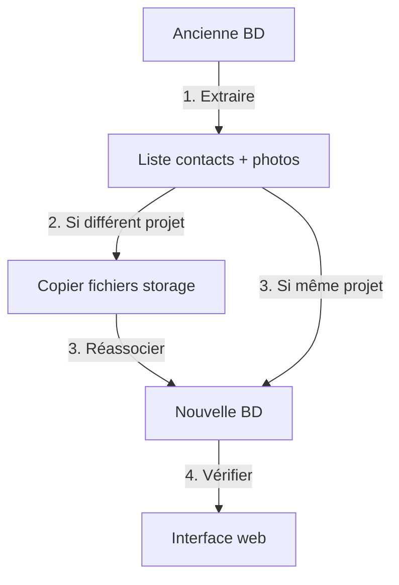

# 📸 Guide de migration des photos de contacts

## 🎯 Objectif

Ce guide explique comment récupérer les photos des contacts depuis votre ancienne base de données Supabase et les réassocier dans la nouvelle base.

---

## 📋 Processus en 3 étapes

### **Étape 1️⃣ : Interroger l'ancienne base**
### **Étape 2️⃣ : Copier les fichiers storage (si nécessaire)**
### **Étape 3️⃣ : Réassocier dans la nouvelle base**

---

## 🔍 Étape 1 : Interroger l'ancienne base

### **Fichier : `QUERY_OLD_CONTACTS_PHOTOS.sql`**

Ouvrez votre **ancienne base Supabase** et exécutez ce script dans le SQL Editor.

### **Options disponibles :**

#### **Option A : Liste simple**
```sql
SELECT 
  id as contact_id,
  first_name,
  last_name,
  email,
  photo_url
FROM public.contacts
WHERE photo_url IS NOT NULL
ORDER BY last_name, first_name;
```

**Résultat attendu :**
```
contact_id                            | first_name | last_name | email                          | photo_url
--------------------------------------|------------|-----------|--------------------------------|-------------------
10c9f05a-fd5b-4de1-b4aa-d687b51850c7 | Greg       | Fischer   | artists@venogefestival.ch      | https://...jpg
352564c5-9237-4b54-8707-7e003afdc6e4 | JB         | TCO       | jb@tcoprod.eu                  | https://...jpg
...
```

#### **Option B : Export CSV**
Exécutez la requête et **copiez le résultat en CSV** pour l'utiliser plus tard.

#### **Option C : Vérifier le storage**
```sql
SELECT 
  name as filename,
  bucket_id,
  created_at
FROM storage.objects
WHERE bucket_id = 'contact-photos'
ORDER BY created_at DESC;
```

Cela vous montre tous les fichiers physiques dans le bucket.

#### **Option D : Mapping complet**
Cette requête fait une jointure entre `contacts` et `storage.objects` pour voir quels contacts ont quelles photos.

---

## 📦 Étape 2 : Copier les fichiers storage (si différents projets)

### **Cas 1 : Même projet Supabase** ✅
Si vous utilisez le **même projet Supabase**, les fichiers sont déjà là !
→ **Passez directement à l'étape 3**

### **Cas 2 : Projet Supabase différent** 🔄

Si vous avez changé de projet Supabase, vous devez copier les fichiers :

#### **Méthode 1 : Via l'interface Supabase**
1. Ouvrir **Storage** dans l'ancien projet
2. Aller dans le bucket `contact-photos`
3. Télécharger tous les fichiers
4. Ouvrir le **nouveau projet**
5. Aller dans **Storage** > `contact-photos`
6. Upload les fichiers

#### **Méthode 2 : Via l'API** (script automatique)
```bash
# À exécuter en local (Node.js/Deno)
# Script pour copier les fichiers d'un projet à l'autre
```

Créez un script TypeScript/JavaScript pour automatiser :
```typescript
import { createClient } from '@supabase/supabase-js';

const oldSupabase = createClient('OLD_URL', 'OLD_KEY');
const newSupabase = createClient('NEW_URL', 'NEW_KEY');

// Liste des fichiers
const { data: files } = await oldSupabase.storage
  .from('contact-photos')
  .list();

// Pour chaque fichier
for (const file of files) {
  // Télécharger
  const { data: blob } = await oldSupabase.storage
    .from('contact-photos')
    .download(file.name);
  
  // Upload dans nouveau projet
  await newSupabase.storage
    .from('contact-photos')
    .upload(file.name, blob);
}
```

---

## 🔗 Étape 3 : Réassocier dans la nouvelle base

### **Fichier : `20251104_180000_reassociate_contact_photos.sql`**

Ouvrez votre **nouvelle base Supabase** et exécutez ce script.

### **Scénarios possibles :**

#### **Scénario A : IDs identiques entre anciennes et nouvelles bases** ✅

**Situation :** Vous avez gardé les mêmes IDs de contacts lors de l'import.

**Action :** Vérifier que les URLs sont correctes

```sql
SELECT 
  id,
  first_name,
  last_name,
  photo_url
FROM public.crm_contacts
WHERE photo_url IS NOT NULL;
```

Si les URLs sont déjà présentes et correctes → **C'est déjà fait !** ✅

---

#### **Scénario B : Correction des URLs** 🔧

**Situation :** Les URLs pointent vers l'ancien projet Supabase.

**Action :** Remplacer l'ancienne URL par la nouvelle

```sql
DO $$
DECLARE
  v_old_url text := 'https://OLD_PROJECT.supabase.co';
  v_new_url text := 'https://oqqphvcylcsxgxbtvwau.supabase.co';
BEGIN
  UPDATE public.crm_contacts
  SET photo_url = replace(photo_url, v_old_url, v_new_url)
  WHERE photo_url LIKE v_old_url || '%';
END $$;
```

---

#### **Scénario C : Réassociation manuelle par ID** 📝

**Situation :** Vous avez une liste de correspondances contact_id → photo_url.

**Action :** Mettre à jour par batch

```sql
UPDATE public.crm_contacts
SET photo_url = mapping.new_photo_url
FROM (VALUES
  ('10c9f05a-fd5b-4de1-b4aa-d687b51850c7', 'https://...jpg'),
  ('352564c5-9237-4b54-8707-7e003afdc6e4', 'https://...jpg'),
  -- Ajoutez vos contacts ici...
) AS mapping(contact_id, new_photo_url)
WHERE crm_contacts.id = mapping.contact_id::uuid;
```

---

#### **Scénario D : Réassociation automatique par email** 📧

**Situation :** Les IDs ont changé, mais les emails sont uniques.

**Action :** Matcher par email

```sql
DO $$
BEGIN
  CREATE TEMP TABLE temp_old_photos (
    email text,
    photo_url text
  );
  
  INSERT INTO temp_old_photos (email, photo_url) VALUES
    ('artists@venogefestival.ch', 'https://...jpg'),
    ('jb@tcoprod.eu', 'https://...jpg');
    -- Etc...
  
  UPDATE public.crm_contacts c
  SET photo_url = t.photo_url
  FROM temp_old_photos t
  WHERE c.email_primary = t.email;
END $$;
```

---

## ✅ Vérification finale

Après l'exécution, vérifiez que tout est OK :

```sql
-- Compter les contacts avec photos
SELECT 
  CASE 
    WHEN photo_url IS NOT NULL THEN '✅ Avec photo'
    ELSE '⚠️ Sans photo'
  END as status,
  count(*) as nombre
FROM public.crm_contacts
GROUP BY status;
```

**Résultat attendu :**
```
status           | nombre
-----------------|-------
✅ Avec photo    | 12
⚠️ Sans photo    | 44
```

---

## 🎨 Tester dans l'interface

1. Aller sur `/app/contacts/personnes`
2. Cliquer sur **Vue Grille** (icône grille)
3. Vérifier que les photos apparaissent correctement
4. Les contacts sans photo doivent afficher leurs initiales

---

## 🔧 Dépannage

### ❌ **Problème : "Les photos n'apparaissent pas"**

**Causes possibles :**
1. Les URLs pointent vers l'ancien projet
2. Le bucket `contact-photos` n'est pas public
3. Les fichiers n'existent pas physiquement

**Solutions :**
```sql
-- 1. Vérifier les URLs
SELECT photo_url FROM crm_contacts WHERE photo_url IS NOT NULL LIMIT 5;

-- 2. Vérifier que le bucket est public
-- Dans Supabase Dashboard > Storage > contact-photos > Settings > Public

-- 3. Vérifier l'existence des fichiers
SELECT count(*) FROM storage.objects WHERE bucket_id = 'contact-photos';
```

---

### ❌ **Problème : "403 Forbidden sur les photos"**

**Cause :** Le bucket n'est pas public.

**Solution :** 
1. Aller dans **Storage** > `contact-photos`
2. **Settings**
3. Activer **Public bucket**

Ou via SQL :
```sql
UPDATE storage.buckets
SET public = true
WHERE name = 'contact-photos';
```

---

## 📊 Résumé du workflow



---

## 🎉 C'est fait !

Une fois toutes les photos réassociées, vos contacts apparaîtront avec leurs vraies photos dans la vue grille !

Les contacts sans photo afficheront automatiquement leurs initiales avec un joli gradient violet. 💜


